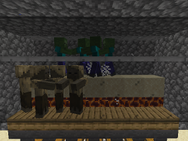

# Better Husks Datapack
A minecraft 1.14+ datapack that provides an in-game mechanic to convert zombies 
to husks, and drowned to zombies; along with providing a renewable source of 
sand.

This datapack was written to alleviate the issue of biome destruction on the 
INSIST Stream Team's server. Husks that are converted in this pack will drop 
sand in addition to their normal mob drops.

This pack **requires** the `Biomes Scanner` datapack to also be installed, 
which can be found [here](https://github.com/akoimeexx/biomes-scanner/releases).

`readme.md` is not required in the datapack zip file, but may be included with 
no ill effects.

`LICENSE` is not required in the datapack zip file, but may be included with 
no ill effects.

## Usage
Find loads of zombies. Cook'em. Wait for conversion. Profit.

## Structure
* `data`
  * `akoimeexx`
    * `functions`
      * `better_husks`
        * `init.mcfunction`  
          Sets up scoreboard "timer" objective during `#minecraft:load`
        * `replace.mcfunction`  
          Summons a new husk to take the place of and then kill `@s`
        * `replace_drowned.mcfunction`  
          Summons a new zombie to take the place of and then kill `@s`
        * `search.mcfunction`  
          Runs `akoimeexx:better_husks/replace[_drowned]` for targets that 
          match the conversion parameters and resets the scoreboard "timer" 
          objective
        * `ticked.mcfunction`  
          Increases scoreboard "timer" objective during `#minecraft:tick` and 
          runs `akoimeexx:better_husks/search` on matching `20..`
        * `uninstall.mcfunction`  
          Removes scoreboard "timer" objective
    * `loot_tables`
      * `better_husks`
        * `entities`
          * `sandy_husk.json`
            Converted husk loot table file supplies two loot pools, one for 
            sand and the other to roll the `minecraft:entities/husk` loot table
    * `tags`
      * `blocks`
        * `better_husks`
          * `air.json`
            Block group that specifies what blocks must be in the space of the 
            converting mob
          * `dessicant.json`
            Block group that specifies what blocks the converting mob must be 
            standing on
          * `heat.json`
            Block group that specifies what blocks the converting mob must be 
            standing one block above
      * `entity_types`
        * `better_husks`
          * `converts.json`
            Entity type group that specifies what entities can be targeted by 
            `akoimeexx:better_husks/search`
  * `minecraft`
    * `tags`
      * `functions`
        * `load.json`
        * `tick.json`
* `pack.mcmeta`
* `pack.png`
* `readme.md`
* `LICENSE`
